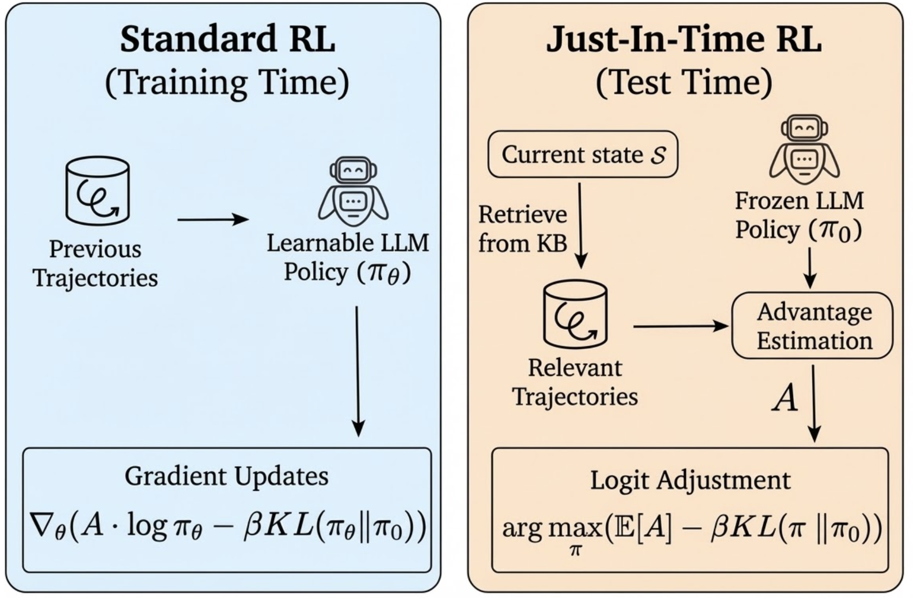
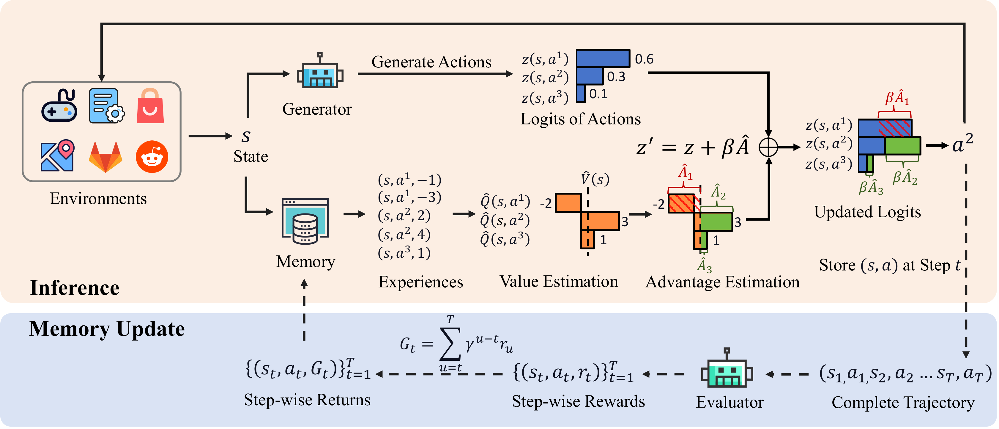

# JitRL: Just-in-Time Reinforcement Learning

<p align="center">
  <b>Continual Learning in LLM Agents Without Gradient Updates</b>
</p>

<p align="center">
  <a href="#overview">Overview</a> •
  <a href="#installation">Installation</a> •
  <a href="#quick-start">Quick Start</a> •
  <a href="#architecture">Architecture</a> •
  <a href="#results">Results</a> •
  <a href="#citation">Citation</a>
</p>

---

## Overview

While LLM agents excel at general tasks, they struggle with **continual adaptation** due to frozen weights after deployment. Conventional RL offers a solution but incurs prohibitive computational costs and the risk of catastrophic forgetting.

<p align="center">
  
</p>
<p align="center">
  <em>Standard RL performs gradient updates during training; JitRL operates at test time by retrieving relevant trajectories to estimate advantages and refine output logits.</em>
</p>

**JitRL** is a training-free framework that enables **test-time policy optimization without any gradient updates**. Instead of updating parameters, JitRL:

- Maintains a **dynamic, non-parametric memory** that stores experience trajectories as `<state, action, reward>` triplets
- **Retrieves relevant trajectories** given the current state to estimate action advantages on-the-fly
- **Directly modulates the LLM's output logits** based on these advantage estimates

We theoretically prove that this additive update rule is the **exact closed-form solution** to the KL-constrained policy optimization objective.

<p align="center">
  
</p>
<p align="center">
  <em>JitRL Framework: The inference stream retrieves experiences from memory to estimate advantages and adjust action logits; the memory update stream stores evaluated trajectories with step-wise returns.</em>
</p>

### Supported Environments

| Environment | Domain | Tasks | Description |
|-------------|--------|-------|-------------|
| **Jericho** | Text Adventure Games | 16+ games | Interactive fiction games (Zork, Library, etc.) |
| **WebArena** | Web Automation | 812 tasks | Real-world web tasks (shopping, admin, maps, etc.) |

---

## Key Features

- **Jaccard Similarity Matching**: N-gram based similarity for trajectory retrieval
- **LLM-based Step Scoring**: Automatic evaluation of action quality
- **Dynamic Prompt Generation**: Adaptive prompts based on task and history
- **Multi-model Support**: OpenAI, Anthropic, Google, and open-source models via OpenRouter

---

## Installation

### Prerequisites

- Python 3.10+
- OpenRouter API key (for LLM inference)

### Clone Repository

```bash
git clone https://github.com/your-username/JitRL.git
cd JitRL
```

### Jericho Setup (Text Adventure Games)

```bash
cd Jericho

# Install dependencies
pip install jericho openai tiktoken numpy python-dotenv

# Download game ROMs (required)
# Place .z5/.z8 files in jericho-games/ directory
# Games available: zork1, zork3, library, detective, etc.
```

### WebArena Setup (Web Automation)

```bash
cd WebArena

# Install dependencies
pip install browsergym-core browsergym-experiments
pip install openai tiktoken numpy langchain pillow
```

### Environment Configuration

Create a `.env` file in the project root:

```bash
# OpenRouter API (for LLM inference)
OPENROUTER_API_KEY=your_openrouter_key

# WebArena URLs (if running locally)
WA_SHOPPING=http://localhost:7770
WA_SHOPPING_ADMIN=http://localhost:7780/admin
WA_REDDIT=http://localhost:9999
WA_GITLAB=http://localhost:8023
WA_MAP=http://localhost:3000
WA_WIKIPEDIA=http://localhost:8888
```

---

## Quick Start

### Jericho: Text Adventure Games

```bash
cd Jericho

# Run memory agent on Zork 1 for 10 episodes
python main.py --game_name zork1 --agent_type memory --eval_runs 10

# Run with cross-episode memory disabled (baseline)
python main.py --game_name zork1 --agent_type memory --no-enable_cross_mem

# Run UCB tree search agent
python main.py --game_name library --agent_type our --eval_runs 50

# Use different LLM model
python main.py --game_name zork1 --llm_model gpt-4o --eval_runs 10
```

**Key Arguments:**

| Argument | Default | Description |
|----------|---------|-------------|
| `--game_name` | `library` | Game to play |
| `--agent_type` | `memory` | Agent: `memory`, `our`, `naive`, `awm` |
| `--eval_runs` | `50` | Number of episodes |
| `--llm_model` | `gemini-2.5-flash` | LLM model |
| `--env_step_limit` | `50` | Max steps per episode |
| `--enable_cross_mem` | `True` | Enable cross-episode memory |
| `--gamma` | `0.95` | Discount factor for rewards |

### WebArena: Web Automation

```bash
cd WebArena

# Run single task with memory agent
python test_webarena_lite.py --tasks 0 --repeat 5 --model gpt-4o

# Run multiple tasks in parallel
python test_webarena_lite.py --start 0 --end 10 --workers 4 --repeat 3

# Run with screenshots for vision-capable models
python test_webarena_lite.py --tasks 68 --model gpt-4o \
    --use_screenshot_action --use_screenshot_eval

# Run without memory (baseline)
python test_webarena_lite.py --tasks 0 --repeat 10 --disable_memory
```

**Key Arguments:**

| Argument | Default | Description |
|----------|---------|-------------|
| `--tasks` | - | Comma-separated task IDs (e.g., `0,1,2`) |
| `--start/--end` | - | Task ID range |
| `--repeat` | `1` | Episodes per task |
| `--workers` | `1` | Parallel workers |
| `--model` | `gpt-4o` | LLM model |
| `--max_steps` | `30` | Max steps per episode |
| `--disable_memory` | `False` | Disable memory system |

---

## Architecture

### Project Structure

```
JitRL/
├── Jericho/                          # Text Adventure Games
│   ├── main.py                       # Entry point
│   ├── console_play.py               # Interactive play mode
│   └── src/
│       ├── memory_agent.py           # Memory-augmented agent (850 lines)
│       ├── our_agent.py              # UCB tree search agent (620 lines)
│       ├── naive_agent.py            # Simple baseline agent
│       ├── awm_agent.py              # Agent Workflow Memory
│       ├── cross_episode_memory.py   # Core memory system (900 lines)
│       ├── evaluation.py             # Game evaluator
│       ├── env.py                    # Jericho environment wrapper
│       ├── utils.py                  # LLM utilities (1150 lines)
│       ├── openai_helpers.py         # API helpers
│       └── prompt_update_with_history.py  # Prompt optimization
│
├── WebArena/                         # Web Automation
│   ├── test_webarena_lite.py         # Main test script
│   ├── run.py                        # Legacy entry point
│   ├── memory_agents/
│   │   ├── memory_agent.py           # BrowserGym agent (1450 lines)
│   │   ├── dynamic_prompting.py      # Prompt generation (760 lines)
│   │   └── utils/
│   │       ├── cross_episode_memory.py  # Memory system (1200 lines)
│   │       ├── openai_helpers.py     # LLM utilities
│   │       ├── llm_utils.py          # Parsing utilities
│   │       └── utils.py              # General utilities (2100 lines)
│   ├── autoeval/                     # Evaluation system
│   │   ├── evaluator.py              # LLM-based evaluator
│   │   ├── enhanced_evaluator.py     # Rule-based evaluator
│   │   └── live_evaluator.py         # Real-time evaluation
│   ├── config_files/                 # Full WebArena (812 tasks)
│   └── config_files_lite/            # WebArena-Lite (165 tasks)
│
└── README.md
```

---

## Supported Models

JitRL supports any model available through OpenRouter:

| Provider | Models | Notes |
|----------|--------|-------|
| **OpenAI** | `gpt-4o`, `gpt-4-turbo`, `gpt-4o-mini` | Best for structured output |
| **Anthropic** | `claude-3.5-sonnet`, `claude-3-opus` | Strong reasoning |
| **Google** | `gemini-2.5-flash`, `gemini-2.5-pro` | Cost-effective |
| **Meta** | `llama-3.1-70b`, `llama-3.1-405b` | Open-source |
| **Mistral** | `mistral-large`, `mixtral-8x22b` | Fast inference |

---

## Results

### Jericho Text Adventures

| Game | Naive Agent | Memory Agent | Improvement |
|------|-------------|--------------|-------------|
| Zork1 | 35.2 | 52.8 | +50% |
| Library | 18.5 | 28.3 | +53% |
| Detective | 180 | 265 | +47% |

*Scores averaged over 50 episodes*

### WebArena-Lite

| Model | Without Memory | With Memory | Improvement |
|-------|----------------|-------------|-------------|
| GPT-4o | 32.5% | 41.2% | +27% |
| Claude-3.5 | 28.8% | 38.5% | +34% |
| Gemini-2.5 | 25.3% | 34.7% | +37% |

*Success rate on 165 WebArena-Lite tasks*

---

## Advanced Usage

### Clearing Memory

```python
from src.cross_episode_memory import CrossEpisodeMemory

memory = CrossEpisodeMemory("output/game/agent/model")
memory.clear_memory(save_to_disk=True)
```

### Custom Retrieval Parameters

```bash
# Adjust retrieval sensitivity
python main.py --game_name zork1 \
    --retrieval_top_k 10 \
    --retrieval_threshold 0.8 \
    --gamma 0.95
```

### Prompt Optimization

```bash
# Enable automatic prompt updates
python main.py --game_name zork1 \
    --update_guiding_prompt \
    --use_history_prompt
```

---

## Troubleshooting

### Common Issues

1. **OpenRouter rate limits**: Use exponential backoff (built-in)
2. **Memory errors**: Reduce `--retrieval_top_k` or `--max_memory`
3. **WebArena connection**: Ensure Docker containers are running

### Logging

Logs are saved to:
- Jericho: `output/{game}/{agent}/{model}/{timestamp}/`
- WebArena: `results/{task_id}/` or `--log_dir`

---

## Citation

If you use JitRL in your research, please cite:

```bibtex
@misc{jitrl2024,
  title={JitRL: Just-in-Time Reinforcement Learning with Cross-Episode Memory for LLM Agents},
  author={Your Name},
  year={2024},
  howpublished={\url{https://github.com/your-username/JitRL}}
}
```

---

## Acknowledgments

- [Jericho](https://github.com/microsoft/jericho) - Text adventure game framework by Microsoft Research
- [BrowserGym](https://github.com/ServiceNow/BrowserGym) - Web automation framework by ServiceNow
- [WebArena](https://webarena.dev/) - Web agent benchmark by CMU

---

## License

This project is for research purposes only. See [LICENSE](LICENSE) for details.
