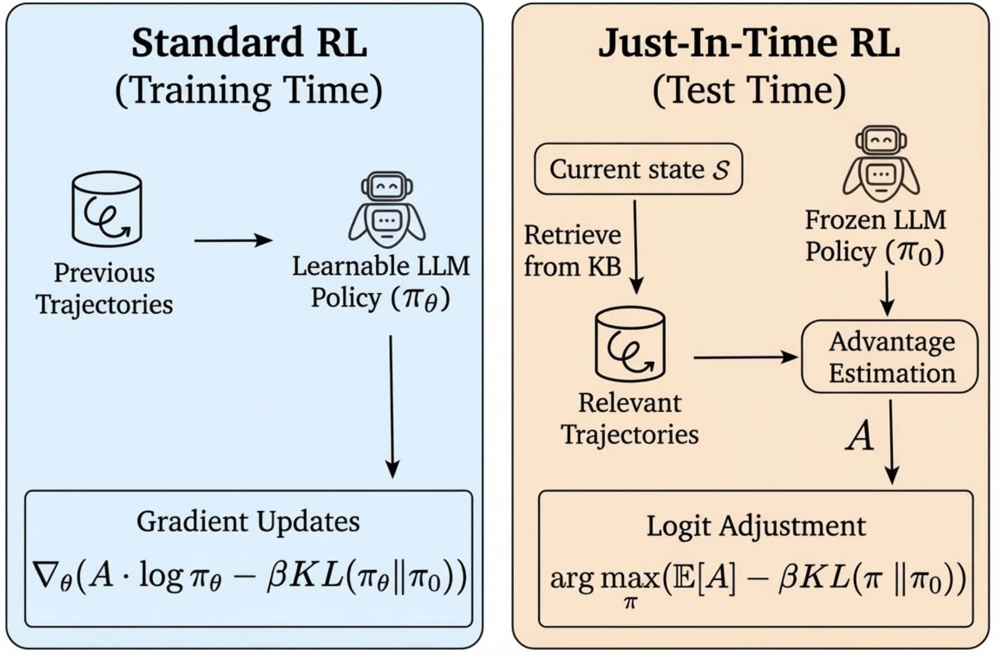
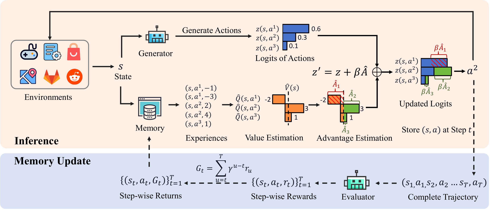

# JitRL: Just-in-Time Reinforcement Learning

<p align="center">
  <b>Continual Learning in LLM Agents Without Gradient Updates</b>
</p>

<p align="center">
  🎉 <b>Accepted at ICML 2026 (Spotlight)</b> •
  <a href="https://arxiv.org/abs/2601.18510">arXiv:2601.18510</a>
</p>

<p align="center">
  <a href="#overview">Overview</a> •
  <a href="#installation">Installation</a> •
  <a href="#quick-start">Quick Start</a> •
  <a href="#architecture">Architecture</a> •
  <a href="#results">Results</a> •
  <a href="#citation">Citation</a>
</p>

---

## Overview

While LLM agents excel at general tasks, they struggle with **continual adaptation** due to frozen weights after deployment. Conventional RL offers a solution but incurs prohibitive computational costs and the risk of catastrophic forgetting.

<p align="center">
  
</p>
<p align="center">
  <em>Standard RL performs gradient updates during training; JitRL operates at test time by retrieving relevant trajectories to estimate advantages and refine output logits.</em>
</p>

**JitRL** is a training-free framework that enables **test-time policy optimization without any gradient updates**. Instead of updating parameters, JitRL:

- Maintains a **dynamic, non-parametric memory** that stores experience trajectories as `<state, action, reward>` triplets
- **Retrieves relevant trajectories** given the current state to estimate action advantages on-the-fly
- **Directly modulates the LLM's output logits** based on these advantage estimates

We theoretically prove that this additive update rule is the **exact closed-form solution** to the KL-constrained policy optimization objective.

<p align="center">
  
</p>
<p align="center">
  <em>JitRL Framework: The inference stream retrieves experiences from memory to estimate advantages and adjust action logits; the memory update stream stores evaluated trajectories with step-wise returns.</em>
</p>

### Supported Environments

| Environment | Domain | Tasks | Description |
|-------------|--------|-------|-------------|
| **Jericho** | Text Adventure Games | 16+ games | Interactive fiction games (Zork, Library, etc.) |
| **WebArena** | Web Automation | 812 tasks | Real-world web tasks (shopping, admin, maps, etc.) |

---

## Key Features

- **Jaccard Similarity Matching**: N-gram based similarity for trajectory retrieval
- **LLM-based Step Scoring**: Automatic evaluation of action quality
- **Dynamic Prompt Generation**: Adaptive prompts based on task and history
- **Multi-model Support**: OpenAI, Anthropic, Google, and open-source models via OpenRouter

---

## Installation

### Prerequisites

- Python 3.10+
- OpenRouter API key (for LLM inference)

### Clone Repository

```bash
git clone https://github.com/your-username/JitRL.git
cd JitRL
```

### Jericho Setup (Text Adventure Games)

```bash
cd Jericho

# Install dependencies
pip install jericho openai tiktoken numpy python-dotenv

# Download game ROMs (required)
# Place .z5/.z8 files in jericho-games/ directory
# Games available: zork1, zork3, library, detective, etc.
```

### WebArena Setup (Web Automation)

```bash
cd WebArena

# Install dependencies
pip install browsergym-core browsergym-experiments
pip install openai tiktoken numpy langchain pillow
```

### Environment Configuration

Create a `.env` file in the project root:

```bash
# OpenRouter API (for LLM inference)
OPENROUTER_API_KEY=your_openrouter_key

# WebArena URLs (if running locally)
WA_SHOPPING=http://localhost:7770
WA_SHOPPING_ADMIN=http://localhost:7780/admin
WA_REDDIT=http://localhost:9999
WA_GITLAB=http://localhost:8023
WA_MAP=http://localhost:3000
WA_WIKIPEDIA=http://localhost:8888
```

---

## Quick Start

### Optional single-forward decisions

The default `--decision_mode legacy` retains the existing generated-action
workflow, including `--confidence_mode` (Jericho) or `--logit_mode` (WebArena).
Use `--decision_mode single_forward` to give a local LLM a closed set of actions
and score every option at one next-token position. This mode does not generate
reasoning, action text, or verbal confidence. It reads candidate logits from
the full vocabulary and applies softmax **only across the supplied candidates**.
Option labels must each map to one vocabulary token; unsupported candidate
counts and oversized prompts fail explicitly instead of dropping choices.

Install the optional backend from the repository root, in addition to the
environment's existing dependencies:

```bash
python -m pip install -e '.[local]'
cd Jericho
python main.py --game_name zork1 --agent_type jitrl --eval_runs 10 \
    --decision_mode single_forward --decision_model Qwen/Qwen3-8B \
    --decision_beta 1.0
```

Jericho supplies `info['valid']` as the candidate set. All valid actions are
scored; `--top_actions` does not truncate this set. `--decision_model` is the
local decision model; `--llm_model` and the evaluation model remain available
for existing memory/reward helpers. Use a model with a chat template; Qwen3
thinking is disabled for this decision pass. The 8B example requires enough
device memory for its weights and prompt.

The existing memory retriever and advantage estimator are reused. For this
mode the final policy is `softmax(log(p_base) + normalized_advantage / beta)`,
with finite `beta > 0`. The highest-probability allowed action is executed.
Memory cannot add actions outside the supplied set. Logs contain both
`base_probabilities` and `policy_probabilities`; the latter are action-selection
probabilities, not guaranteed calibrated success probabilities.

For WebArena, actions can include arbitrary text entry, so there is no automatic
finite action list. Supply a state-aware candidate provider with this signature:

```python
def candidates(*, state, history, info, url, instruction):
    # Return unique, currently valid BrowserGym action strings for this page.
    # Use state/instruction to choose real element IDs and text values.
    return build_candidates(state, instruction)
```

Put the function in an importable module (the `build_candidates` function above
is your domain-specific implementation), then use the direct WebArena runner:

```bash
cd WebArena
python run.py --task_name webarena.0 --agent_type memory \
    --decision_mode single_forward --decision_model Qwen/Qwen3-8B \
    --decision_candidate_provider my_candidates:candidates
```

The provider receives fresh state each step and must supply valid action strings.
It can also be used in Jericho to select a subset of environment-valid actions.
Single-forward mode uses text state, not screenshot input. The WebArena batch
wrapper `test_webarena_lite.py` accepts the same decision flags; start with
`--workers 1` since each worker loads its own local model. Candidate construction, memory processing, step summaries,
and reward evaluation may make additional calls: **one forward refers to the
decision scorer after candidates are available**, not the complete agent step.

Run offline tests with `python -m unittest discover -s tests -v` from the root.
With the local extra installed, this includes a randomly initialized tiny Llama
test checking exactly one forward and candidate-only normalization; no model
download, game server, API credentials, or paid requests are needed for tests.

### Jericho: Text Adventure Games

```bash
cd Jericho

# Run JitRL agent on Zork 1 for 10 episodes
python main.py --game_name zork1 --agent_type jitrl --eval_runs 10

# Run with cross-episode memory disabled (baseline)
python main.py --game_name zork1 --agent_type jitrl --no-enable_cross_mem

# Use different LLM model
python main.py --game_name zork1 --llm_model openai/gpt-4o --eval_runs 10
```

**Key Arguments:**

| Argument | Default | Description |
|----------|---------|-------------|
| `--game_name` | `library` | Game to play |
| `--agent_type` | `jitrl` | Agent: `jitrl`, `naive`, `awm` |
| `--eval_runs` | `50` | Number of episodes |
| `--llm_model` | `google/gemini-2.5-flash` | LLM model |
| `--env_step_limit` | `50` | Max steps per episode |
| `--enable_cross_mem` | `True` | Enable cross-episode memory |
| `--gamma` | `0.5` | Discount factor for rewards |

> **Note on reproducibility:** The Gemini-2.5-Flash results in the paper were obtained with the
> `google/gemini-2.5-flash-preview-09-2025` snapshot on OpenRouter, which has since been retired.
> The defaults now point to the stable `google/gemini-2.5-flash`; reproduced numbers may differ
> slightly due to the model version change.

### WebArena: Web Automation

```bash
cd WebArena

# Run single task with memory agent
python test_webarena_lite.py --tasks 0 --repeat 5 --model gpt-4o

# Run multiple tasks in parallel
python test_webarena_lite.py --start 0 --end 10 --workers 4 --repeat 3

# Run with screenshots for vision-capable models
python test_webarena_lite.py --tasks 68 --model gpt-4o \
    --use_screenshot_action --use_screenshot_eval

# Run without memory (baseline)
python test_webarena_lite.py --tasks 0 --repeat 10 --disable_memory
```

**Key Arguments:**

| Argument | Default | Description |
|----------|---------|-------------|
| `--tasks` | - | Comma-separated task IDs (e.g., `0,1,2`) |
| `--start/--end` | - | Task ID range |
| `--repeat` | `1` | Episodes per task |
| `--workers` | `1` | Parallel workers |
| `--model` | `gpt-4o` | LLM model |
| `--max_steps` | `30` | Max steps per episode |
| `--disable_memory` | `False` | Disable memory system |

---

## Architecture

### Project Structure

```
JitRL/
├── Jericho/                          # Text Adventure Games
│   ├── main.py                       # Entry point
│   ├── console_play.py               # Interactive play mode
│   └── src/
│       ├── jitrl_agent.py            # JitRL agent: retrieval + advantage + logit modulation (850 lines)
│       ├── naive_agent.py            # Simple baseline agent
│       ├── awm_agent.py              # Agent Workflow Memory
│       ├── cross_episode_memory.py   # Core memory system (900 lines)
│       ├── evaluation.py             # Game evaluator
│       ├── env.py                    # Jericho environment wrapper
│       ├── utils.py                  # LLM utilities (1150 lines)
│       ├── openai_helpers.py         # API helpers
│       └── prompt_update_with_history.py  # Prompt optimization
│
├── WebArena/                         # Web Automation
│   ├── test_webarena_lite.py         # Main test script
│   ├── run.py                        # Legacy entry point
│   ├── memory_agents/
│   │   ├── jitrl_agent.py            # JitRL BrowserGym agent (1450 lines)
│   │   ├── dynamic_prompting.py      # Prompt generation (760 lines)
│   │   └── utils/
│   │       ├── cross_episode_memory.py  # Memory system (1200 lines)
│   │       ├── openai_helpers.py     # LLM utilities
│   │       ├── llm_utils.py          # Parsing utilities
│   │       └── utils.py              # General utilities (2100 lines)
│   ├── autoeval/                     # Evaluation system
│   │   ├── evaluator.py              # LLM-based evaluator
│   │   ├── enhanced_evaluator.py     # Rule-based evaluator
│   │   └── live_evaluator.py         # Real-time evaluation
│   ├── config_files/                 # Full WebArena (812 tasks)
│   └── config_files_lite/            # WebArena-Lite (165 tasks)
│
└── README.md
```

---

## Supported Models

JitRL supports any model available through OpenRouter:

| Provider | Models | Notes |
|----------|--------|-------|
| **OpenAI** | `gpt-4o`, `gpt-4-turbo`, `gpt-4o-mini` | Best for structured output |
| **Anthropic** | `claude-3.5-sonnet`, `claude-3-opus` | Strong reasoning |
| **Google** | `gemini-2.5-flash`, `gemini-2.5-pro` | Cost-effective |
| **Meta** | `llama-3.1-70b`, `llama-3.1-405b` | Open-source |
| **Mistral** | `mistral-large`, `mixtral-8x22b` | Fast inference |

---

## Results

### Jericho Text Adventures

| Game | Naive Agent | Memory Agent | Improvement |
|------|-------------|--------------|-------------|
| Zork1 | 35.2 | 52.8 | +50% |
| Library | 18.5 | 28.3 | +53% |
| Detective | 180 | 265 | +47% |

*Scores averaged over 50 episodes*

### WebArena-Lite

| Model | Without Memory | With Memory | Improvement |
|-------|----------------|-------------|-------------|
| GPT-4o | 32.5% | 41.2% | +27% |
| Claude-3.5 | 28.8% | 38.5% | +34% |
| Gemini-2.5 | 25.3% | 34.7% | +37% |

*Success rate on 165 WebArena-Lite tasks*

---

## Advanced Usage

### Clearing Memory

```python
from src.cross_episode_memory import CrossEpisodeMemory

memory = CrossEpisodeMemory("output/game/agent/model")
memory.clear_memory(save_to_disk=True)
```

### Custom Retrieval Parameters

```bash
# Adjust retrieval sensitivity
python main.py --game_name zork1 \
    --retrieval_top_k 10 \
    --retrieval_threshold 0.8 \
    --gamma 0.95
```

### Prompt Optimization

```bash
# Enable automatic prompt updates
python main.py --game_name zork1 \
    --update_guiding_prompt \
    --use_history_prompt
```

---

## Troubleshooting

### Common Issues

1. **OpenRouter rate limits**: Use exponential backoff (built-in)
2. **Memory errors**: Reduce `--retrieval_top_k` or `--max_memory`
3. **WebArena connection**: Ensure Docker containers are running

### Logging

Logs are saved to:
- Jericho: `output/{game}/{agent}/{model}/{timestamp}/`
- WebArena: `results/{task_id}/` or `--log_dir`

---

## Citation

If you use JitRL in your research, please cite:

```bibtex
@article{li2026just,
  title={Just-In-Time Reinforcement Learning: Continual Learning in LLM Agents Without Gradient Updates},
  author={Li, Yibo and Lin, Zijie and Deng, Ailin and Zhang, Xuan and He, Yufei and Ji, Shuo and Cao, Tri and Hooi, Bryan},
  journal={arXiv preprint arXiv:2601.18510},
  year={2026}
}
```

---

## Acknowledgments

- [Jericho](https://github.com/microsoft/jericho) - Text adventure game framework by Microsoft Research
- [BrowserGym](https://github.com/ServiceNow/BrowserGym) - Web automation framework by ServiceNow
- [WebArena](https://webarena.dev/) - Web agent benchmark by CMU

---

## License

This project is for research purposes only. See [LICENSE](LICENSE) for details.
